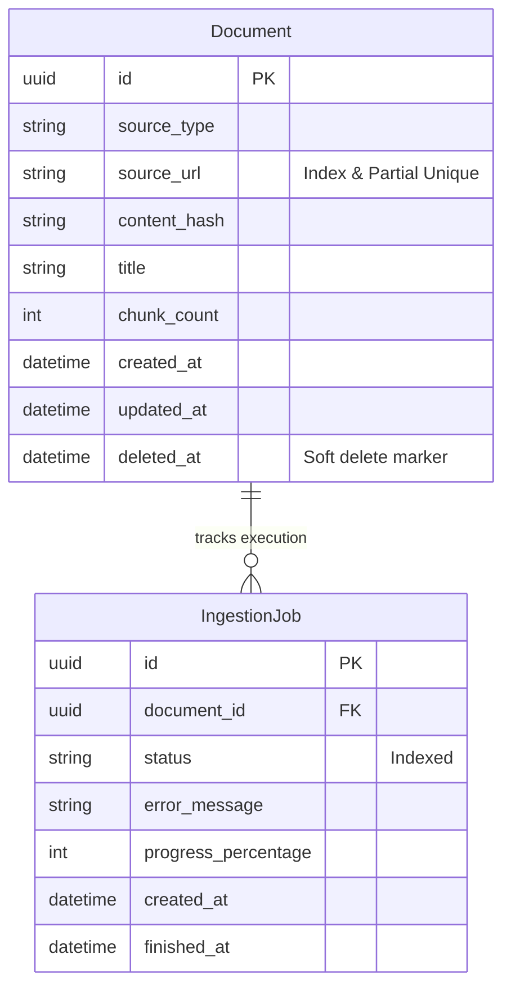
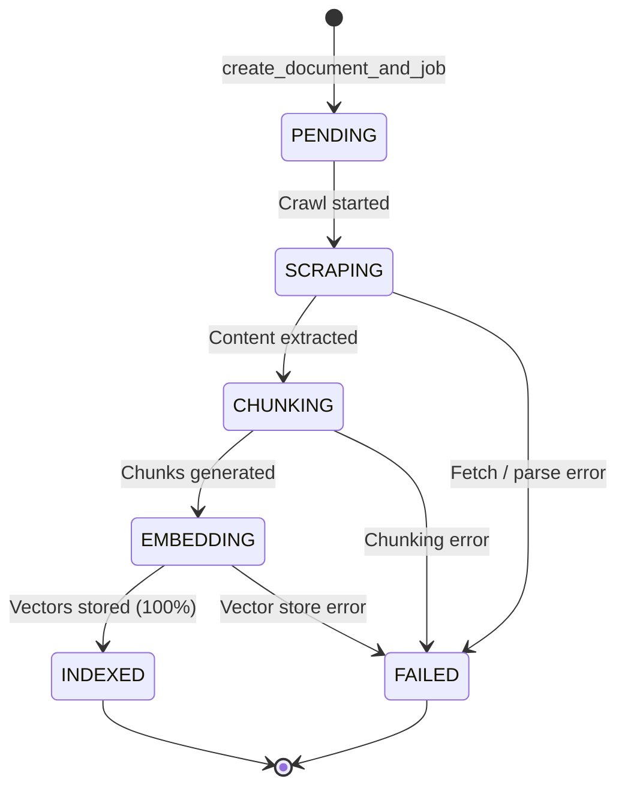
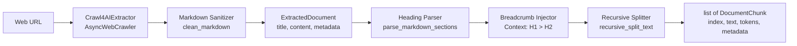

# RAG Ingestion Pipeline

A modular, production-ready RAG ingestion pipeline on a single server, featuring asynchronous document processing, vector storage, and state tracking.

## Architecture & Tech Stack

- **Framework**: [FastAPI](https://fastapi.tiangolo.com/) & [Uvicorn](https://www.uvicorn.org/)
- **Configuration**: [Pydantic Settings](https://docs.pydantic.dev/latest/concepts/pydantic_settings/)
- **Database**: PostgreSQL 16 managed via [SQLModel](https://sqlmodel.tiangolo.com/) and [Alembic](https://alembic.sqlalchemy.org/)
- **Task Queue**: [ARQ](https://arq-docs.helpmanual.io/) & [Redis 7](https://redis.io/)
- **Vector Database**: [Qdrant](https://qdrant.tech/) (v1.9+)
- **Embeddings & LLM**: [Ollama](https://ollama.ai/) (`bge-m3`)
- **Extraction**: [crawl4ai](https://github.com/unclecode/crawl4ai)
- **Linter & Type Checking**: [Ruff](https://docs.astral.sh/ruff/)

---

## Directory Structure

```text
rag-ingestion-pipeline/
├── alembic/          # Alembic migrations environment & revision scripts
│   ├── versions/     # Version migration files
│   └── env.py        # Async migration runner with SQLModel metadata
├── app/
│   ├── api/          # FastAPI routes, routers, and request/response models
│   ├── core/         # Core settings, database engine, session management
│   ├── models/       # SQLModel database tables and domain entities
│   ├── services/     # Ingestion repository, content extractors, chunkers
│   └── workers/      # ARQ async background task workers
├── openspec/         # OpenSpec planning specifications, active/archived changes
├── scripts/          # Operational utilities (e.g. check_env.py)
├── tests/            # Test suite (pytest)
├── alembic.ini       # Alembic database configuration
├── docker-compose.yml# Local backing services
├── pyproject.toml    # Python project packaging and dependency specifications
└── .env.example      # Environment variable template
```

---

## Database Layer & State Models

### Entity Relationship & Schema

- **`Document`**: Represents registered ingestion targets with audit fields and non-destructive soft deletes.
  - Enforces a PostgreSQL conditional unique index `uq_documents_active_source_url` on `source_url WHERE deleted_at IS NULL`, preventing active duplicates while permitting re-ingestion after soft deletion.
- **`IngestionJob`**: Represents background ingestion jobs associated with a document via foreign key cascade.



### Job State Machine Lifecycle



### Repository Access Functions (`app.services.repository`)

- `check_active_url(session, url)`: Lookup active non-deleted document by URL.
- `create_document_and_job(session, source_type, source_url, title)`: Registers a document and creates its initial `PENDING` job, raising `DuplicateActiveURLError` on collision.
- `update_job_status(session, job_id, status, progress_percentage, error_message)`: Transitions job status, tracks progress, and sets `finished_at` UTC timestamp upon reaching terminal states (`INDEXED` / `FAILED`).
- `soft_delete_document(session, doc_id)`: Marks `deleted_at` and `updated_at`, releasing URL deduplication constraints.

### Database Migrations (Alembic)

Alembic is configured for async operations using `SQLModel.metadata`.

```bash
# Apply migrations to latest revision
alembic upgrade head

# Rollback one migration revision
alembic downgrade -1

# Rollback to baseline
alembic downgrade base

# Generate new autogenerated migration after model changes
alembic revision --autogenerate -m "describe changes"

# Inspect static SQL without connecting to database
alembic upgrade head --sql
```

---

## Content Extraction & Chunking Engine

The pipeline implements an extensible data extraction and structure-aware chunking engine decoupled from database and queue logic.



### 1. Document Extraction (`app.services.extractors`)

- **`BaseExtractor`**: Runtime-checkable `typing.Protocol` defining `async def extract(self, source: str) -> ExtractedDocument`.
- **`ExtractedDocument`**: Immutable Pydantic model containing:
  - `content`: Cleaned, normalized Markdown text.
  - `title`: Extracted document title (resolved via metadata, first `# H1` heading, or URL path).
  - `source_url`: Canonical URL or file path.
  - `metadata`: Arbitrary source metadata (language, canonical URL, crawl timestamp).
- **`Crawl4AIExtractor`**: Crawler implementation backed by Crawl4AI's `AsyncWebCrawler`:
  - Configured with default exclusion tags (`nav`, `footer`, `header`) and CSS selectors (`.vector-header`, `.vector-sidebar`, `#mw-navigation`, `.reference`, `.reflist`, `.mw-editsection`, `.infobox`, `table.infobox`) to strip navigation, sidebars, and infobox clutter.
  - Normalizes metadata and raises domain `ExtractionError` on non-2xx HTTP responses or crawler failures.
- **Markdown Sanitizer (`cleaning.py`)**:
  - `remove_edit_links`: Strips `[edit]`, `[edit | edit source]`, and edit action links.
  - `remove_citation_markers`: Strips numbered citations (`[1]`, `[12]`) and footnote notes (`[note 1]`, `[citation needed]`) while preserving standard Markdown hyperlinks.
  - `normalize_whitespace`: Trims line trailing spaces, collapses multiple inline spaces, and eliminates redundant blank lines (≥ 3 newlines collapsed to 2).

### 2. Hybrid Markdown Chunking (`app.services.chunkers`)

- **`BaseChunker`**: Runtime-checkable `typing.Protocol` defining `def chunk(self, document: ExtractedDocument | str, metadata: dict | None = None) -> list[DocumentChunk]`.
- **`DocumentChunk`**: Immutable Pydantic entity containing:
  - `chunk_index`: Zero-based sequential integer index.
  - `text`: Non-empty chunk text.
  - `char_count`: Character length of the text.
  - `token_count`: Estimated token count (`max(1, len(text) // 4)`).
  - `metadata`: Section breadcrumbs (`heading_path`, `breadcrumb`) merged with document metadata.
- **`parse_markdown_sections`**: Segments documents along `#`, `##`, `###` heading boundaries while shielding fenced code blocks (` ``` `, `~~~`) from `#` comment misidentification.
- **`recursive_split_text`**: Subdivides text along natural boundaries (`\n\n` → `\n` → ` ` → character slices) with configurable `max_chunk_size` and `chunk_overlap`.
- **`HybridMarkdownChunker`**:
  - Partitions content into sections preserving hierarchical breadcrumbs (e.g. `["Computer Science", "Algorithms", "Quicksort"]`).
  - Optionally prepends contextual breadcrumbs to chunk text: `[Context: Computer Science > Algorithms > Quicksort]\n\n...` to maximize embedding retrieval quality.
  - Recursively splits oversized sections exceeding `max_chunk_size` (default: 3200 characters / ~800 tokens) while preserving section breadcrumbs across all sub-chunks.

### 3. Usage Example

```python
import asyncio
from app.services.extractors.web import Crawl4AIExtractor
from app.services.chunkers.hybrid import HybridMarkdownChunker


async def main():
    extractor = Crawl4AIExtractor()
    chunker = HybridMarkdownChunker(max_chunk_size=3200, chunk_overlap=400)

    # Extract clean Markdown
    doc = await extractor.extract("https://en.wikipedia.org/wiki/Ada_Lovelace")

    # Chunk with hierarchical breadcrumbs
    chunks = chunker.chunk(doc)
    for chunk in chunks:
        print(f"[{chunk.chunk_index}] {chunk.metadata['breadcrumb']} ({chunk.token_count} tokens)")


asyncio.run(main())
```

---


## Quickstart Guide

### 1. Environment Setup

Create and activate a Python 3.11+ virtual environment:

```bash
# Windows PowerShell
python -m venv .venv
.venv\Scripts\Activate.ps1

# Linux / macOS
python3 -m venv .venv
source .venv/bin/activate
```

Install dependencies:

```bash
pip install -e ".[dev]"
```

### 2. Configure Environment

Copy the example environment file:

```bash
cp .env.example .env
```

### 3. Launch Local Infrastructure

Start PostgreSQL, Redis, Qdrant, and Ollama using Docker Compose:

```bash
docker compose up -d
```

Verify service connectivity:

```bash
python scripts/check_env.py
```

Apply database migrations:

```bash
alembic upgrade head
```

### 4. Running Tests & Quality Checks

Execute the test suite using `pytest`:

```bash
pytest
```

Run linting, formatting, and type annotation checks using `ruff`:

```bash
# Run linting and type-checking rules
ruff check .

# Check code formatting
ruff format --check .
```

### 5. Standalone Content Extraction CLI

Extract and sanitize web content directly to Markdown for isolated testing of `Crawl4AIExtractor`:

```bash
# Extract web page to auto-named markdown file (e.g. ada_lovelace.md)
python scripts/extract_to_markdown.py https://en.wikipedia.org/wiki/Ada_Lovelace

# Specify custom output destination
python scripts/extract_to_markdown.py https://en.wikipedia.org/wiki/Alan_Turing -o data/turing.md

# Run quietly
python scripts/extract_to_markdown.py https://en.wikipedia.org/wiki/Alan_Turing -q
```


---

## Development Guidelines

Please refer to [`AGENTS.md`](AGENTS.md) for development workflows, including:
- Mandatory **Test-Driven Development (TDD)**.
- Dedicated Git branch for every OpenSpec change.
- Updating `README.md` with every change.
