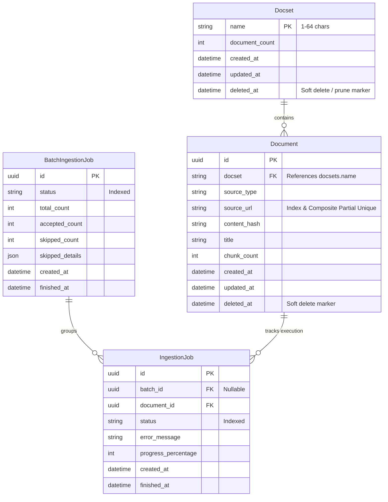
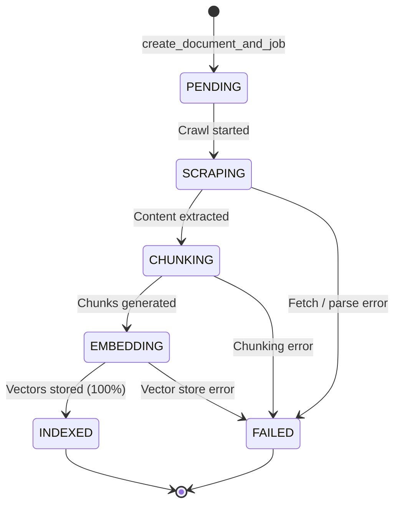
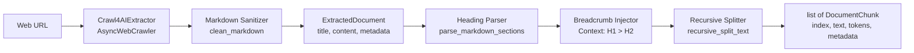

# RAG Ingestion Pipeline

A modular, production-ready RAG ingestion pipeline on a single server, featuring asynchronous document processing, vector storage, and state tracking.

## Architecture & Tech Stack

- **Framework**: [FastAPI](https://fastapi.tiangolo.com/) & [Uvicorn](https://www.uvicorn.org/)
- **Configuration**: [Pydantic Settings](https://docs.pydantic.dev/latest/concepts/pydantic_settings/)
- **Database**: PostgreSQL 16 managed via [SQLModel](https://sqlmodel.tiangolo.com/) and [Alembic](https://alembic.sqlalchemy.org/)
- **Task Queue**: [ARQ](https://arq-docs.helpmanual.io/) & [Redis 7](https://redis.io/)
- **Vector Database**: [Qdrant](https://qdrant.tech/) (v1.9+)
- **Embeddings & LLM**: [Ollama](https://ollama.ai/) (`bge-m3`)
- **Extraction**: [crawl4ai](https://github.com/unclecode/crawl4ai)
- **Logging**: [Loguru](https://github.com/Delgan/loguru) (structured logging, stdlib interception, correlation IDs)
- **Linter & Type Checking**: [Ruff](https://docs.astral.sh/ruff/)

---

## Directory Structure

```text
rag-ingestion-pipeline/
├── alembic/          # Alembic migrations environment & revision scripts
│   ├── versions/     # Version migration files
│   └── env.py        # Async migration runner with SQLModel metadata
├── app/
│   ├── api/          # FastAPI routes, routers, and request/response models
│   │   ├── deps.py       # Dependency injection helpers (db, dispatcher, vector store)
│   │   ├── schemas.py    # Pydantic request and response schemas
│   │   └── v1/           # API version 1 router and endpoints
│   │       └── endpoints/
│   │           ├── docsets.py   # Docset management, batch ingestion, scoped search & deletion
│   │           └── documents.py # Document ingestion, status, list, check, delete
│   ├── core/         # Settings, security & domain validation, logging, dispatcher protocol
│   ├── models/       # SQLModel database tables and domain entities
│   ├── services/     # Services: repository, extractors, chunkers, embeddings, vector_store, pipeline
│   │   ├── chunkers/     # Context-aware HybridMarkdownChunker
│   │   ├── embeddings/   # Asynchronous Ollama embedding client (bge-m3)
│   │   ├── extractors/   # Crawl4AI web extraction, strategies, and cleaning
│   │   │   └── strategies/ # Domain-specific extraction strategies (Wikipedia, Registry)
│   │   ├── vector_store/ # Qdrant vector store adapter & search
│   │   ├── pipeline.py   # IngestionPipelineService orchestrator
│   │   └── repository.py # Document & IngestionJob state repository
│   ├── workers/      # ARQ background task runner, WorkerSettings, and dispatcher
│   └── main.py       # FastAPI application entry point, lifespan, CORS, and exception handlers
├── openspec/         # OpenSpec planning specifications, active/archived changes
├── scripts/          # Operational utilities (e.g. check_env.py)
├── tests/            # Test suite (pytest)
├── alembic.ini       # Alembic database configuration
├── docker-compose.yml# Local backing services
├── pyproject.toml    # Python project packaging and dependency specifications
└── .env.example      # Environment variable template
```

---

## Database Layer & State Models

### Entity Relationship & Schema

- **`Docset`**: Groups documents into isolated, human-readable collections. Tracks active `document_count` and soft-delete state (`deleted_at`). Auto-pruned when document count drops to zero.
- **`Document`**: Represents registered ingestion targets scoped to a `docset` with audit fields and non-destructive soft deletes.
  - Enforces a composite conditional unique index `uq_documents_active_docset_source_url` on `(docset, source_url) WHERE deleted_at IS NULL`, allowing identical URLs in different docsets while preventing duplicates within the same docset.
- **`BatchIngestionJob`**: Represents a batch submission request tracking aggregate batch status, total/accepted/skipped document counts, and skipped document details.
- **`IngestionJob`**: Represents individual background ingestion jobs associated with a document and grouped under a `BatchIngestionJob`.




### Job State Machine Lifecycle



### Repository Access Functions (`app.services.repository`)

- `check_active_url(session, url)`: Lookup active non-deleted document by URL.
- `create_batch_and_jobs(session, items, source_type="url", allowed_domains=None)`: Atomically validates domain allowlists, inspects document statuses, deduplicates URLs, records skipped items (`domain_not_allowed`, `duplicate_in_request`, etc.), and creates `BatchIngestionJob` along with child `Document` and `IngestionJob` records.
- `get_batch_job_status(session, batch_id)`: Computes aggregate batch lifecycle state and progress percentage, returning all child job statuses and skipped reasons.
- `create_document_and_job(session, source_type, source_url, title)`: Registers a document and creates its initial `PENDING` job, raising `DuplicateActiveURLError` on collision.
- `update_job_status(session, job_id, status, progress_percentage, error_message)`: Transitions job status, tracks progress, and sets `finished_at` UTC timestamp upon reaching terminal states (`INDEXED` / `FAILED`).
- `soft_delete_document(session, doc_id)`: Marks `deleted_at` and `updated_at`, releasing URL deduplication constraints.

### Database Migrations (Alembic)

Alembic is configured for async operations using `SQLModel.metadata`.

```bash
# Apply migrations to latest revision
alembic upgrade head

# Rollback one migration revision
alembic downgrade -1

# Rollback to baseline
alembic downgrade base

# Generate new autogenerated migration after model changes
alembic revision --autogenerate -m "describe changes"

# Inspect static SQL without connecting to database
alembic upgrade head --sql
```

---

## Content Extraction & Chunking Engine

The pipeline implements an extensible data extraction and structure-aware chunking engine decoupled from database and queue logic.



### 1. Document Extraction (`app.services.extractors`)

- **`BaseExtractor`**: Runtime-checkable `typing.Protocol` defining `async def extract(self, source: str) -> ExtractedDocument`.
- **`ExtractedDocument`**: Immutable Pydantic model containing:
  - `content`: Cleaned, normalized Markdown text.
  - `title`: Extracted document title (resolved via metadata, first `# H1` heading, or URL path).
  - `source_url`: Canonical URL or file path.
  - `metadata`: Arbitrary source metadata (language, canonical URL, crawl timestamp).
- **`DomainExtractionStrategy` (`strategies.base`)**: Runtime-checkable `typing.Protocol` defining domain extraction contracts:
  - `domain_prefix: str`: URL domain prefix identifying the target site (e.g., `https://en.wikipedia.org`).
  - `get_run_config() -> CrawlerRunConfig`: Crawl configuration specifying excluded tags, CSS exclusion selectors, cache mode, and markdown generators.
  - `get_browser_config() -> BrowserConfig`: Headless browser execution parameters.
  - `clean(markdown: str) -> str`: Domain-tailored post-crawl markdown sanitizer.
- **`WikipediaExtractionStrategy` (`strategies.wikipedia`)**: Strategy implementation for Wikipedia:
  - Excludes navigation, header, footer, references, edit sections, and infoboxes (`nav`, `footer`, `header`, `.vector-header`, `.vector-sidebar`, `#mw-navigation`, `.reference`, `.reflist`, `.mw-editsection`, `.infobox`, `table.infobox`).
  - Strips citation markers (`[1]`, `[note 1]`) and edit links while normalizing whitespace.
- **`ExtractionStrategyRegistry` (`strategies.registry`)**: Registry matching URLs against domain strategies by domain prefix; defaults to singleton via `get_default_strategy_registry()`.
- **`Crawl4AIExtractor`**: Crawler implementation backed by Crawl4AI's `AsyncWebCrawler`:
  - Resolves tailored domain strategy via `ExtractionStrategyRegistry` based on URL prefix.
  - Executes crawl with domain-specific `CrawlerRunConfig` and `BrowserConfig`, post-processes markdown with `strategy.clean()`, normalizes metadata, and raises domain `ExtractionError` on non-2xx HTTP responses or crawler failures.
- **Markdown Sanitizer (`cleaning.py`)**:
  - `remove_edit_links`: Strips `[edit]`, `[edit | edit source]`, and edit action links.
  - `remove_citation_markers`: Strips numbered citations (`[1]`, `[12]`) and footnote notes (`[note 1]`, `[citation needed]`) while preserving standard Markdown hyperlinks.
  - `normalize_whitespace`: Trims line trailing spaces, collapses multiple inline spaces, and eliminates redundant blank lines (≥ 3 newlines collapsed to 2).

### 2. Hybrid Markdown Chunking (`app.services.chunkers`)

- **`BaseChunker`**: Runtime-checkable `typing.Protocol` defining `def chunk(self, document: ExtractedDocument | str, metadata: dict | None = None) -> list[DocumentChunk]`.
- **`DocumentChunk`**: Immutable Pydantic entity containing:
  - `chunk_index`: Zero-based sequential integer index.
  - `text`: Non-empty chunk text.
  - `char_count`: Character length of the text.
  - `token_count`: Estimated token count (`max(1, len(text) // 4)`).
  - `metadata`: Section breadcrumbs (`heading_path`, `breadcrumb`) merged with document metadata.
- **`parse_markdown_sections`**: Segments documents along `#`, `##`, `###` heading boundaries while shielding fenced code blocks (` ``` `, `~~~`) from `#` comment misidentification.
- **`recursive_split_text`**: Subdivides text along natural boundaries (`\n\n` → `\n` → ` ` → character slices) with configurable `max_chunk_size` and `chunk_overlap`.
- **`HybridMarkdownChunker`**:
  - Partitions content into sections preserving hierarchical breadcrumbs (e.g. `["Computer Science", "Algorithms", "Quicksort"]`).
  - Optionally prepends contextual breadcrumbs to chunk text: `[Context: Computer Science > Algorithms > Quicksort]\n\n...` to maximize embedding retrieval quality.
  - Recursively splits oversized sections exceeding `max_chunk_size` (default: 3200 characters / ~800 tokens) while preserving section breadcrumbs across all sub-chunks.

### 3. Usage Example

```python
import asyncio
from app.services.extractors.web import Crawl4AIExtractor
from app.services.chunkers.hybrid import HybridMarkdownChunker


async def main():
    extractor = Crawl4AIExtractor()
    chunker = HybridMarkdownChunker(max_chunk_size=3200, chunk_overlap=400)

    # Extract clean Markdown
    doc = await extractor.extract("https://en.wikipedia.org/wiki/Ada_Lovelace")

    # Chunk with hierarchical breadcrumbs
    chunks = chunker.chunk(doc)
    for chunk in chunks:
        print(f"[{chunk.chunk_index}] {chunk.metadata['breadcrumb']} ({chunk.token_count} tokens)")


asyncio.run(main())
```

---

## Vector Storage & Embeddings Layer

The semantic storage and retrieval layer pairs local multilingual dense embeddings generated by Ollama with fast, filtered vector storage in Qdrant.

### 1. Ollama Embedding Client (`app.services.embeddings`)

- **Model**: `bge-m3` multilingual dense embedding model (1024 vector dimensions, 8192-token context window).
- **HTTP Endpoint**: Asynchronously targets Ollama's `/api/embed` endpoint via `httpx.AsyncClient`.
- **Batch Processing**: Groups chunks into configurable batch sizes (`batch_size=8` default via `EMBEDDING_BATCH_SIZE`) to optimize network roundtrips and avoid request timeouts on dense text.
- **Configurable HTTP Timeout**: Per-request timeout configurable via `EMBEDDING_TIMEOUT` (`120.0s` default) to prevent spurious read timeouts during heavy embedding passes.
- **Hardware Acceleration**: Docker Compose configuration includes NVIDIA GPU device reservations for `rag_ollama`, enabling massive embedding throughput speedups (up to 40x faster than CPU).
- **Resilient Retries**: Implements exponential backoff retry for transient network errors (`httpx.RequestError`) and server errors (HTTP 5xx, 429), failing fast on non-retriable 4xx client errors with typed `EmbeddingError`.
- **Dimension Validation**: Strictly verifies that returned vectors match the expected 1024-dimensional float format.

### 2. Qdrant Vector Store Adapter (`app.services.vector_store`)

- **Collection Lifecycle**: Idempotently initializes the `knowledge_base` collection configured with Cosine distance and 1024 vector dimensions. Automatic initialization is performed during FastAPI lifespan, ARQ worker startup, and directly in `IngestionPipelineService` before upserting chunks.
- **Connection Security**: Normalizes empty or unset `QDRANT_API_KEY` environment variables to `None` to avoid insecure connection warnings over standard HTTP.
- **Keyword Payload Index**: Automatically ensures a keyword schema index on `doc_id` exists to power sub-millisecond filtered queries and deletions.
- **Deterministic Point UUIDs**: Uses RFC 4122 `uuid5` derived from `uuid.NAMESPACE_DNS` and `"{doc_id}:{chunk_index}"` to guarantee idempotent upserts without point duplication.
- **Comprehensive Payloads**: Stores rich queryable metadata alongside each vector: `doc_id`, `chunk_index`, `text`, `source_url`, `heading_path`, `char_count`, and `token_count`.
- **Filtered Cascade Deletions**: Deletes all points for a document via payload filter on `doc_id` in a single atomic operation (`delete_by_doc_id`).
- **Semantic Search**: Supports top-k nearest neighbor vector search with similarity scores, score threshold filtering, and document-scoping filters (`search`).

### 3. Usage Example

```python
import asyncio
from app.services.chunkers.hybrid import HybridMarkdownChunker
from app.services.embeddings.ollama import OllamaEmbeddingClient
from app.services.vector_store.qdrant import QdrantVectorStore


async def main():
    # 1. Chunk document
    chunker = HybridMarkdownChunker(max_chunk_size=1200)
    chunks = chunker.chunk(
        "# Overview\n\nAI retrieval systems require vector search.",
        metadata={"source_url": "https://example.com"},
    )

    # 2. Generate embeddings
    async with OllamaEmbeddingClient() as embed_client:
        vectors = await embed_client.embed_batch([c.text for c in chunks])

    # 3. Store in Qdrant
    async with QdrantVectorStore() as vector_store:
        await vector_store.initialize_collection()
        await vector_store.upsert_chunks(doc_id="doc_123", chunks=chunks, vectors=vectors)

        # 4. Search
        query_vector = await embed_client.embed_text("vector search systems")
        results = await vector_store.search(query_vector=query_vector, limit=3)
        for hit in results:
            print(f"Score: {hit.score:.4f} | Point: {hit.point_id} | Text: {hit.payload['text']}")

        # 5. Cascade delete
        await vector_store.delete_by_doc_id("doc_123")


asyncio.run(main())
```

---

## Task Dispatcher & Pipeline Service

The asynchronous processing tier decouples client-facing request ingestion from heavy extraction, chunking, and embedding workflows.

```text
[Client / API]
       │
       ▼  (enqueue_ingestion_job)
[ArqTaskDispatcher] ──▶ [Redis Queue (ARQ)]
                               │
                               ▼  (Worker Process)
                      [run_ingestion_pipeline]
                               │
                               ▼
                   [IngestionPipelineService]
           ┌───────────────────┼───────────────────┐
           ▼                   ▼                   ▼
   [Crawl4AIExtractor]  [HybridChunker]  [OllamaClient] ──▶ [QdrantStore]
   (SCRAPING: 20%)     (CHUNKING: 40%)   (EMBEDDING: 70%)   (INDEXED: 100%)
```

### 1. Abstract Task Dispatcher (`app.core.dispatcher` & `app.workers.dispatcher`)

The `TaskDispatcher` protocol decouples queue clients from specific broker technologies:

```python
from app.core.dispatcher import TaskDispatcher
from app.workers.dispatcher import ArqTaskDispatcher

# Instantiate ARQ Redis dispatcher
dispatcher: TaskDispatcher = ArqTaskDispatcher()

# Enqueue background ingestion job
await dispatcher.enqueue_ingestion_job(
    job_id=job.id,
    document_id=document.id,
    url="https://en.wikipedia.org/wiki/Documentation",
)
```

- **Parameter Serialization**: Serializes job/document identifiers to string representations and sets `_job_id` for deduplication.
- **Connection Failure Handling**: Catches Redis broker errors and raises domain `DispatcherError`.
- **Resource Management**: Provides `close()` for clean client shutdown.

### 2. Ingestion Pipeline Service (`app.services.pipeline`)

`IngestionPipelineService` coordinates the multi-stage document lifecycle with full dependency injection and defense-in-depth domain validation:

```python
from app.services.pipeline import IngestionPipelineService

pipeline = IngestionPipelineService()

# Run full pipeline with automatic state transitions and error capture
await pipeline.run(
    job_id=job.id,
    document_id=document.id,
    url="https://en.wikipedia.org/wiki/Documentation",
)
```

- **Defense-in-Depth Validation**: Verifies the URL against `allowed_domains` (default: `Settings.allowed_domains`) using `is_allowed_url` before triggering crawler extraction, immediately failing disallowed URLs without issuing external network requests.
- **Dependency Injection**: Fully supports custom `extractor`, `chunker`, `embedding_client`, `vector_store`, `session_factory`, and `allowed_domains` overrides.

#### Stepwise Lifecycle Overview

| Stage | Progress | Description |
|---|---|---|
| `PENDING` | 0% | Job record created in database; waiting for queue dispatch. |
| `SCRAPING` | 20% | `BaseExtractor` extracts clean markdown and title from source URL (after validating URL domain allowlist). |
| `CHUNKING` | 40% | `BaseChunker` creates `DocumentChunk` items with section breadcrumbs. |
| `EMBEDDING` | 70% | `BaseEmbeddingClient` generates 1024-d dense vectors; `BaseVectorStore` upserts points to Qdrant. |
| `INDEXED` | 100% | `Document` record is finalized with title, chunk count, and content hash; `finished_at` is set. |
| `FAILED` | -- | Any domain validation violation, uncaught exception, or task cancellation/timeout (`asyncio.CancelledError`) cleanly shields and updates status to `FAILED`, records `error_message`, and marks `finished_at`. |

### 3. ARQ Background Worker Runner (`app.workers.tasks`)

The background task runner is implemented in `app.workers.tasks`:
- `run_ingestion_pipeline`: Deserializes task parameters, resolves `IngestionPipelineService`, and executes the pipeline.
- `WorkerSettings`: Worker configuration declaring functions, Redis settings, concurrency limits (`max_jobs=10`), configurable task timeout (`job_timeout=900s` via `ARQ_JOB_TIMEOUT`), and lifecycle hooks (`startup` / `shutdown`).

### 4. Running the ARQ Worker

Start the ARQ background worker daemon using the ARQ CLI:

```bash
# Start ARQ worker process
arq app.workers.tasks.WorkerSettings
```

---

## REST API Endpoints

The system provides a validated REST API built with FastAPI exposing document ingestion, status tracking, existence checks, and soft-deletion with vector purging.

Interactive API documentation (Swagger UI) is available at `http://localhost:8000/docs` (OpenAPI schema at `http://localhost:8000/openapi.json`) and health check at `http://localhost:8000/health`. In production environments (`ENVIRONMENT=production`), `/docs`, `/redoc`, `/openapi.json`, and `/health` are automatically disabled for security.

### Running the API Server

Start the API server with Uvicorn:

```bash
# Start FastAPI application
uvicorn app.main:app --host 0.0.0.0 --port 8000 --reload
```

### Endpoints Reference

All document ingestion endpoints are exposed under the canonical versioned prefix: `/api/v1/documents/...`.

#### 1. Submit Batch Ingestion (`POST /api/v1/documents/ingest`)

Submits an array of web URLs for asynchronous scraping, chunking, embedding, and vector indexing under a single parent batch job.

- **Request Body**:
  ```json
  {
    "documents": [
      {
        "url": "https://en.wikipedia.org/wiki/Artificial_intelligence",
        "title": "Artificial Intelligence",
        "metadata": { "source": "wikipedia" }
      },
      {
        "url": "https://en.wikipedia.org/wiki/Machine_learning",
        "title": "Machine Learning"
      }
    ]
  }
  ```
- **Responses**:
  - `202 Accepted`: Batch registered and accepted jobs enqueued.
    ```json
    {
      "main_job_id": "7b5b7b62-1fb8-4cb3-8a39-c1ffea52427a",
      "status": "PENDING",
      "total_submitted": 2,
      "accepted_count": 2,
      "skipped_count": 0,
      "message": "Ingestion batch submitted successfully"
    }
    ```
  - `422 Unprocessable Entity`: Batch exceeds `MAX_BATCH_INGEST_SIZE` (default: 10) or contains invalid URL schemes.
    ```json
    {
      "detail": "Batch size 12 exceeds maximum allowed limit of 10"
    }
    ```
- **Deduplication & Pre-flight Skipping**:
  - **Intra-batch duplicates**: First occurrence is accepted; subsequent duplicates within the same batch are marked `duplicate_in_request`.
  - **Active indexed documents**: URLs already `INDEXED` are skipped with reason `already_ingested`.
  - **Active in-progress documents**: URLs currently `PENDING`, `SCRAPING`, `CHUNKING`, or `EMBEDDING` are skipped with reason `currently_ingesting`.
  - **Failed documents**: URLs whose previous job resulted in `FAILED` are automatically accepted for re-ingestion.
- **Example `curl`**:
  ```bash
  curl -X POST "http://localhost:8000/api/v1/documents/ingest" \
    -H "Content-Type: application/json" \
    -d '{"documents": [{"url": "https://en.wikipedia.org/wiki/Artificial_intelligence", "title": "AI"}]}'
  ```

#### 2. Get Batch Job Status (`GET /api/v1/documents/status/{main_job_id}`)

Retrieves aggregate progress percentage, overall lifecycle status, individual document progress, and skipped details for a batch ingestion job.

- **Path Parameters**:
  - `main_job_id` (UUID): Unique identifier of the batch ingestion job.
- **Responses**:
  - `200 OK`:
    ```json
    {
      "main_job_id": "7b5b7b62-1fb8-4cb3-8a39-c1ffea52427a",
      "status": "PROCESSING",
      "overall_progress_percentage": 50,
      "total_jobs": 2,
      "completed_jobs": 1,
      "failed_jobs": 0,
      "jobs": [
        {
          "url": "https://en.wikipedia.org/wiki/Artificial_intelligence",
          "doc_id": "0d635fc2-d1d4-4cf5-94cf-6c0756778f28",
          "job_id": "9a38f711-470b-426b-8d26-7c933fa1297e",
          "status": "INDEXED",
          "progress_percentage": 100,
          "error_message": null
        },
        {
          "url": "https://en.wikipedia.org/wiki/Machine_learning",
          "doc_id": "1c728e93-e2a5-4bf6-95da-8e1247889b39",
          "job_id": "3f42c820-219d-4819-bf93-61a09d3b841a",
          "status": "SCRAPING",
          "progress_percentage": 20,
          "error_message": null
        }
      ],
      "skipped": [
        {
          "url": "https://en.wikipedia.org/wiki/Artificial_intelligence",
          "reason": "duplicate_in_request",
          "existing_doc_id": null
        }
      ]
    }
    ```
  - `404 Not Found`: Batch job does not exist.
- **Example `curl`**:
  ```bash
  curl -X GET "http://localhost:8000/api/v1/documents/status/7b5b7b62-1fb8-4cb3-8a39-c1ffea52427a"
  ```

#### 3. Check Document Existence (`GET /api/v1/documents/check`)

Checks whether a target URL is currently actively indexed.

- **Query Parameters**:
  - `url` (string, required): Source URL to check.
- **Responses**:
  - `200 OK` (Active document):
    ```json
    {
      "exists": true,
      "doc_id": "0d635fc2-d1d4-4cf5-94cf-6c0756778f28",
      "status": "INDEXED"
    }
    ```
  - `200 OK` (Non-existent or soft-deleted document):
    ```json
    {
      "exists": false,
      "doc_id": null,
      "status": null
    }
    ```
- **Example `curl`**:
  ```bash
  curl -X GET "http://localhost:8000/api/v1/documents/check?url=https://en.wikipedia.org/wiki/Artificial_intelligence"
  ```

#### 4. Delete Document & Purge Vectors (`DELETE /api/v1/documents/{doc_id}`)

Purges all vector embeddings from Qdrant matching `doc_id` and soft-deletes the PostgreSQL document record (`deleted_at = NOW()`), allowing the URL to be re-ingested in the future.

- **Path Parameters**:
  - `doc_id` (UUID): Unique identifier of the active document.
- **Responses**:
  - `200 OK`:
    ```json
    {
      "doc_id": "0d635fc2-d1d4-4cf5-94cf-6c0756778f28",
      "status": "deleted",
      "message": "Document and associated vectors successfully deleted"
    }
    ```
  - `404 Not Found`: Document not found or already soft-deleted.
  - `502 Bad Gateway`: Vector store failed to purge embeddings (preserves PostgreSQL record).
- **Example `curl`**:
  ```bash
  curl -X DELETE "http://localhost:8000/api/v1/documents/0d635fc2-d1d4-4cf5-94cf-6c0756778f28"
  ```

#### 5. List Indexed Documents (`GET /api/v1/documents`)

Retrieves a paginated list of documents currently actively indexed in PostgreSQL and Qdrant. Excludes soft-deleted documents and documents whose latest job state is not `INDEXED`.

- **Query Parameters**:
  - `limit` (integer, optional, default: `20`, minimum: `1`, maximum: `100`): Maximum number of documents to return per page.
  - `offset` (integer, optional, default: `0`, minimum: `0`): Number of documents to skip for pagination.
  - `query` (string, optional): Case-insensitive substring search filter matching against document `title` or `source_url`.
- **Responses**:
  - `200 OK`:
    ```json
    {
      "total": 42,
      "limit": 20,
      "offset": 0,
      "items": [
        {
          "id": "0d635fc2-d1d4-4cf5-94cf-6c0756778f28",
          "source_url": "https://en.wikipedia.org/wiki/Artificial_intelligence",
          "title": "Artificial Intelligence",
          "status": "INDEXED",
          "chunk_count": 14,
          "created_at": "2026-09-10T12:00:00Z",
          "updated_at": "2026-09-10T12:01:00Z"
        }
      ]
    }
    ```
  - `422 Unprocessable Entity`: Pagination parameters out of valid range (e.g. `limit > 100` or `offset < 0`).
- **Example `curl`**:
  ```bash
  # Default listing (first 20 indexed articles)
  curl -X GET "http://localhost:8000/api/v1/documents"

  # Filter by query with custom pagination
  curl -X GET "http://localhost:8000/api/v1/documents?query=intelligence&limit=10&offset=0"
  ```

### Docset Management & Scoped Document Endpoints (`/api/v1/docsets`)

Docsets partition documents into isolated, human-readable collections (1-64 characters matching `^[a-z0-9_-]+$`).

#### 1. Ingest Documents into Docset (`POST /api/v1/docsets/{docset}/documents`)

Submits a batch of URLs for asynchronous ingestion scoped to the specified `docset`. If the docset does not exist or was previously pruned, it is automatically created or revived. The reserved keyword `"default"` is restricted and cannot be ingested into directly.

- **Path Parameters**:
  - `docset` (string): Normalized docset name (1-64 chars, alphanumeric, `-`, `_`).
- **Request Body**: Same as batch ingest (`IngestRequest`).
- **Responses**:
  - `202 Accepted`: Same as batch ingest (`IngestResponse`).
  - `400 Bad Request`: When targeting the reserved `"default"` docset name.
  - `422 Unprocessable Entity`: Invalid docset name pattern or batch limit exceeded.
- **Example `curl`**:
  ```bash
  curl -X POST "http://localhost:8000/api/v1/docsets/ml-papers/documents" \
    -H "Content-Type: application/json" \
    -d '{"documents": [{"url": "https://en.wikipedia.org/wiki/Deep_learning", "title": "Deep Learning"}]}'
  ```

#### 2. List Active Docsets (`GET /api/v1/docsets`)

Retrieves a paginated list of all active non-empty docsets (`document_count > 0` and `deleted_at IS NULL`).

- **Query Parameters**:
  - `limit` (integer, optional, default: `20`, range: `1`-`100`).
  - `offset` (integer, optional, default: `0`, minimum: `0`).
- **Responses**:
  - `200 OK`:
    ```json
    {
      "total": 2,
      "limit": 20,
      "offset": 0,
      "items": [
        {
          "name": "coding-docs",
          "document_count": 12,
          "created_at": "2026-09-16T10:00:00Z",
          "updated_at": "2026-09-16T10:05:00Z"
        },
        {
          "name": "ml-papers",
          "document_count": 5,
          "created_at": "2026-09-16T10:10:00Z",
          "updated_at": "2026-09-16T10:12:00Z"
        }
      ]
    }
    ```
- **Example `curl`**:
  ```bash
  curl -X GET "http://localhost:8000/api/v1/docsets?limit=10&offset=0"
  ```

#### 3. Delete Docset & Purge Vectors (`DELETE /api/v1/docsets/{docset}`)

Soft-deletes all member documents in PostgreSQL, prunes the docset (`deleted_at = NOW()`, `document_count = 0`), and purges all associated vector points in Qdrant matching `docset == {docset}`.

- **Path Parameters**:
  - `docset` (string): Name of docset to delete.
- **Responses**:
  - `200 OK`:
    ```json
    {
      "docset": "ml-papers",
      "status": "deleted",
      "deleted_document_count": 5,
      "message": "Docset and associated vectors successfully deleted"
    }
    ```
  - `400 Bad Request`: If attempting to delete the reserved `"default"` docset.
  - `404 Not Found`: Docset not found or already pruned.
- **Example `curl`**:
  ```bash
  curl -X DELETE "http://localhost:8000/api/v1/docsets/ml-papers"
  ```

#### 4. List Indexed Documents in Docset (`GET /api/v1/docsets/{docset}/documents`)

Retrieves a paginated list of indexed documents belonging strictly to the specified `docset`.

- **Path Parameters**:
  - `docset` (string): Target docset.
- **Query Parameters**:
  - `limit` (integer, default: `20`), `offset` (integer, default: `0`), `query` (optional string search).
- **Responses**:
  - `200 OK`: `DocumentListResponse` scoped to the docset.
- **Example `curl`**:
  ```bash
  curl -X GET "http://localhost:8000/api/v1/docsets/ml-papers/documents?query=deep"
  ```

#### 5. Check Document URL in Docset (`GET /api/v1/docsets/{docset}/documents/check`)

Checks whether a URL is actively indexed in the specified `docset`.

- **Query Parameters**:
  - `url` (string, required): Source URL to check.
- **Responses**:
  - `200 OK`: `{"exists": true, "doc_id": "...", "status": "INDEXED"}` or `{"exists": false, "doc_id": null, "status": null}`.
- **Example `curl`**:
  ```bash
  curl -X GET "http://localhost:8000/api/v1/docsets/ml-papers/documents/check?url=https://en.wikipedia.org/wiki/Deep_learning"
  ```

#### 6. Delete Document from Docset (`DELETE /api/v1/docsets/{docset}/documents/{doc_id}`)

Soft-deletes a single document in the specified docset and purges its vector embeddings from Qdrant. If this document was the last remaining active document in the docset, the docset is automatically pruned (`document_count = 0`, `deleted_at = NOW()`).

- **Path Parameters**:
  - `docset` (string): Target docset.
  - `doc_id` (UUID): Document ID.
- **Responses**:
  - `200 OK`: `DeleteResponse`.
  - `404 Not Found`: If document does not exist or is not active in the specified docset.
- **Example `curl`**:
  ```bash
  curl -X DELETE "http://localhost:8000/api/v1/docsets/ml-papers/documents/0d635fc2-d1d4-4cf5-94cf-6c0756778f28"
  ```

---

## Quickstart Guide

### 1. Environment Setup

Create and activate a Python 3.11+ virtual environment:

```bash
# Windows PowerShell
python -m venv .venv
.venv\Scripts\Activate.ps1

# Linux / macOS
python3 -m venv .venv
source .venv/bin/activate
```

Install dependencies:

```bash
pip install -e ".[dev]"
```

### 2. Configure Environment

Copy the example environment file:

```bash
cp .env.example .env
```

Key environment configuration variables:

| Variable | Default | Description |
| :--- | :--- | :--- |
| `MAX_BATCH_INGEST_SIZE` | `10` | Maximum number of URLs permitted per batch ingestion request |
| `DATABASE_URL` | `postgresql+asyncpg://...` | Async PostgreSQL database connection URL |
| `REDIS_HOST` / `REDIS_PORT` | `localhost:6379` | Redis host and port for ARQ background jobs |
| `ARQ_JOB_TIMEOUT` | `900` | ARQ background job timeout in seconds (accommodates large documents) |
| `QDRANT_HOST` / `QDRANT_PORT` | `localhost:6333` | Qdrant vector database host and REST port |
| `OLLAMA_BASE_URL` | `http://localhost:11434` | Ollama service endpoint for dense embeddings |
| `EMBEDDING_MODEL` | `bge-m3` | Embedding model identifier |
| `EMBEDDING_BATCH_SIZE` | `8` | Chunk batch size per embedding HTTP request |
| `EMBEDDING_TIMEOUT` | `120.0` | HTTP client request timeout in seconds for embedding generation |
| `ENVIRONMENT` | `development` | Runtime environment (`development`, `test`, `production`). Gating `/docs`, `/redoc`, `/openapi.json`, and `/health` to non-production only |
| `LOG_LEVEL` | `INFO` | Logging verbosity (`DEBUG`, `INFO`, `WARNING`, `ERROR`) |

### 3. Launch Local Infrastructure

Start PostgreSQL, Redis, Qdrant, and Ollama using Docker Compose:

```bash
docker compose up -d
```

Verify service connectivity:

```bash
python scripts/check_env.py
```

Apply database migrations:

```bash
alembic upgrade head
```

Start the ARQ background worker:

```bash
arq app.workers.tasks.WorkerSettings
```

Start the FastAPI web server:

```bash
uvicorn app.main:app --host 0.0.0.0 --port 8000 --reload
```

### 4. Running Tests & Quality Checks

Execute the test suite using `pytest`:

```bash
pytest
```

Run tests with 100% coverage enforcement:

```bash
pytest --cov=app --cov-report=term-missing --cov-fail-under=100
```

Run specific pipeline, API, dispatcher, and vector test suites:

```bash
# Run unit tests for API schemas, dependencies, and endpoints
pytest tests/test_api_schemas.py tests/test_api_deps.py tests/test_api_endpoints.py tests/test_main.py

# Run end-to-end API integration tests
pytest tests/test_api_integration.py

# Run unit tests for task dispatcher and worker settings
pytest tests/test_dispatcher.py

# Run unit tests for ingestion pipeline service
pytest tests/test_pipeline_service.py

# Run headless end-to-end pipeline integration tests
pytest tests/test_pipeline_integration.py

# Run unit tests for embeddings and vector storage
pytest tests/test_embeddings.py tests/test_vector_store.py

# Run end-to-end vector pipeline integration tests
pytest tests/test_vector_integration.py
```


Run linting, formatting, and type annotation checks using `ruff`:

```bash
# Run linting and type-checking rules
ruff check .

# Check code formatting
ruff format --check .
```

### 5. Git Hooks (Pre-Commit & Pre-Push)

Automated quality gates are configured in `.pre-commit-config.yaml`:
- **Pre-commit hook**: Enforces that `ruff check .` passes before committing.
- **Pre-push hook**: Enforces **100% test coverage** (`--cov-fail-under=100`) on `app` before pushing.

Install both hooks into your local repository:

```bash
pre-commit install --hook-type pre-commit --hook-type pre-push
```

Manually trigger hooks across all files:

```bash
# Run pre-commit checks (ruff check)
pre-commit run --all-files --hook-stage pre-commit

# Run pre-push checks (100% coverage validation)
pre-commit run --all-files --hook-stage pre-push
```

### 6. Continuous Integration (GitHub Actions)

A GitHub Actions workflow (`.github/workflows/ci.yml`) runs on all pushes and pull requests to `main` and topic branches (`feat/**`, `fix/**`, `refactor/**`):
- **Linter**: `ruff check .`
- **Formatter**: `ruff format --check .`
- **Quality Gate**: `pytest --cov=app --cov-fail-under=100` ensuring 100% statement coverage.

### 7. Standalone Content Extraction CLI

Extract and sanitize web content directly to Markdown for isolated testing of `Crawl4AIExtractor`:

```bash
# Extract web page to auto-named markdown file (e.g. ada_lovelace.md)
python scripts/extract_to_markdown.py https://en.wikipedia.org/wiki/Ada_Lovelace

# Specify custom output destination
python scripts/extract_to_markdown.py https://en.wikipedia.org/wiki/Alan_Turing -o data/turing.md

# Run quietly
python scripts/extract_to_markdown.py https://en.wikipedia.org/wiki/Alan_Turing -q
```


---

## Logging & Observability

The application uses [Loguru](https://github.com/Delgan/loguru) for unified, structured, and contextual logging across API, pipeline, database, and background worker components.

### Core Capabilities
- **Standard Library Interception**: Framework and library loggers (`uvicorn`, `uvicorn.access`, `uvicorn.error`, `fastapi`, `arq`, `sqlalchemy`) are intercepted via `InterceptHandler` in `app/core/logging.py` and routed through Loguru, ensuring uniform formatting and log level controls.
- **Environment-Aware Formatting**:
  - **Development (`ENVIRONMENT=development`)**: Colorized, human-readable terminal output including timestamps, log levels, file/caller locations, structured `{extra}` dictionaries, and exception traces.
  - **Production (`ENVIRONMENT=production`)**: Structured newline-delimited JSON (`serialize=True`) streamed to `sys.stdout`, designed for direct log aggregation in platforms like Datadog, CloudWatch, Grafana Loki, or ELK.
- **HTTP Request Correlation (`X-Request-ID`)**:
  - HTTP middleware in `app/main.py` extracts client-provided `X-Request-ID` headers or auto-generates a UUID4 identifier.
  - Requests are wrapped in `logger.contextualize(request_id=request_id)`, binding the correlation ID to all log records produced during request execution.
  - The `X-Request-ID` header is attached to all outgoing responses and exposed via CORS.
- **Worker & Pipeline Context Binding**:
  - ARQ background tasks (`app/workers/tasks.py`) and `IngestionPipelineService` (`app/services/pipeline.py`) wrap execution in `logger.contextualize(job_id=..., document_id=...)`.
  - Logs emitted during extraction, chunking, embedding, and vector upsert automatically carry job and document tracking IDs.

---

## Development Guidelines

Please refer to [`AGENTS.md`](AGENTS.md) for development workflows, including:
- Mandatory **Test-Driven Development (TDD)**.
- Dedicated Git branch for every OpenSpec change.
- Updating `README.md` with every change.
